# Architecture and data flow

This document is the map of **who talks to whom** and **what data moves**. It does not implement anything.

---

## 1. System in one picture

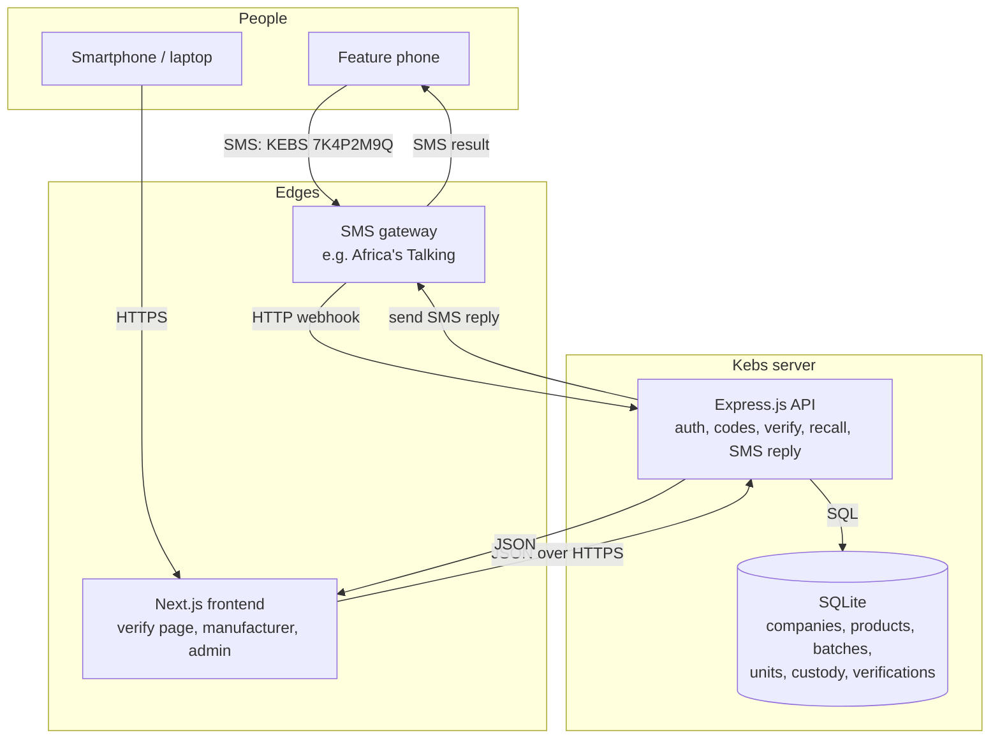

**Rule:** Next.js never talks to SQLite. Only Express reads and writes the database. Next.js is a client of the API. The SMS gateway is also a client of the API.

---

## 2. What each piece is responsible for

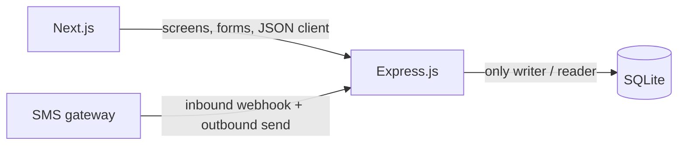

### Next.js (frontend)

- Screens for people with a browser.
- Public: enter a code, see result, optional “report fake”.
- Logged-in: manufacturer and admin work (products, batches, code export, stats, recalls).
- Sends JSON to Express. Shows API errors in plain language.
- Does **not** send SMS. Does **not** store product codes as the source of truth.

### Express.js (backend)

- The only brain: create codes, verify codes, recall batches, authenticate staff users.
- Two entry doors:
  1. **REST JSON** for Next.js.
  2. **SMS webhook** for the gateway (incoming text → lookup → outbound SMS).
- Same verification **rules** for SMS and web, so answers never disagree.

### SQLite (database)

- Source of truth for companies, products, batches, unit codes, custody, and every verification attempt.
- One file for v1. WAL mode when implemented, so SMS and web can write together without locking the app to death.

### SMS gateway (external)

- Receives the consumer’s text from the mobile network.
- POSTs a payload to Express (`from` phone, `text`, `to` short code).
- Sends Express’s reply string back to that phone.
- Kebs does not run a telco. Without this gateway, SMS does not work.

---

## 3. Trust boundary

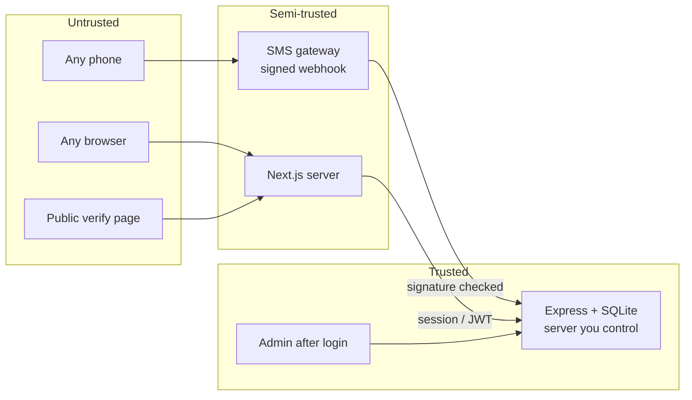

- A verification **code** is a secret printed on a pack. Anyone holding the pack can use it. That is intended.
- A **manufacturer login** is a secret. Only that company may generate codes and recall its own batches.
- Incoming SMS webhooks must be **checked** (gateway signature or shared secret) so strangers cannot fake “SMS checks” and poison the log.
- Consumer phone numbers are **operational data** (needed to reply and to detect repeat checks). Store them hashed or masked in logs where possible; do not put them on public pages.

---

## 4. The unit of truth: one code = one physical pack

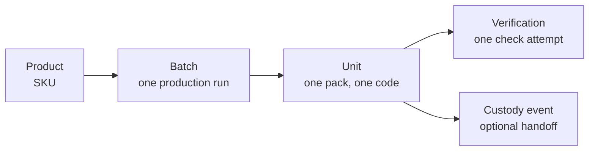

| Idea | Meaning |
| --- | --- |
| **Product** | The SKU (e.g. “Paracetamol 500mg 10 tablets”). |
| **Batch** | One production run of that SKU (dates, expiry, quantity). |
| **Unit** | One pack. Has exactly one **verification_code**. |
| **Verification** | One attempt to check a code (SMS or web). Append-only history. |
| **Custody event** | Optional: pack moved from factory to distributor to shop. |

A fake pack either has **no code**, a **copied code**, or a **guessed code**. The data flow is designed so:

- Unknown code → “Not in Kebs”.
- Copied code → first check looks genuine; later checks warn.
- Recalled batch → every check says recalled, even the first.

---

## 5. End-to-end flows

### Flow A — Manufacturer issues codes

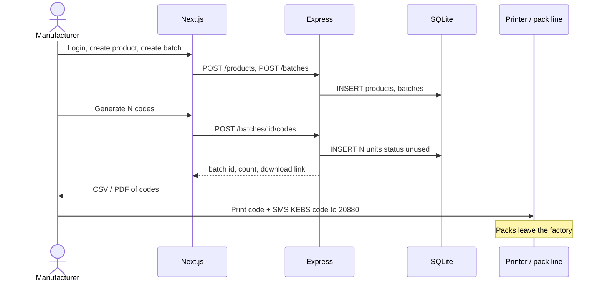

**Data written:** `users` (already exists), `products`, `batches`, `units` (status = `unused`).  
**Data not written yet:** verifications, custody (unless they log a shipment).

---

### Flow B — Optional custody (factory → shop)

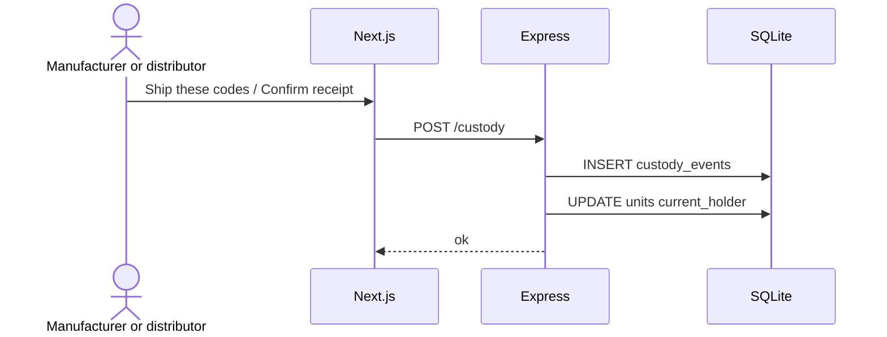

This is **Should**, not required for the first SMS pilot. Verification still works if custody is empty. Custody answers: “where was this pack supposed to be?”

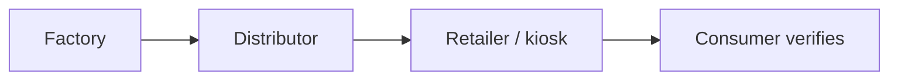

---

### Flow C — Consumer verifies by SMS (core hook)

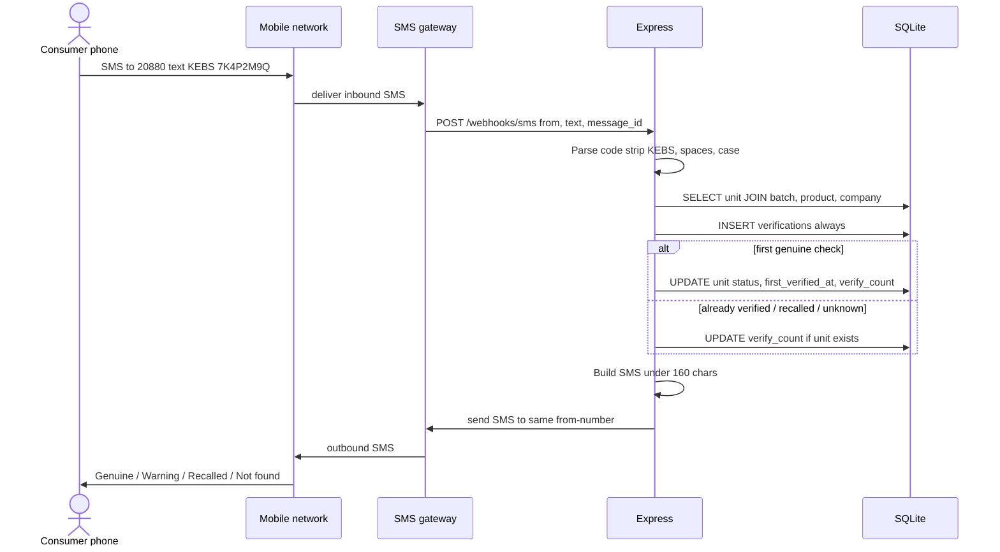

**Data written:** always `verifications`. Sometimes `units` (status/counters).  
**Data read:** `units`, `batches`, `products`, `companies`.

**If the gateway cannot send the reply:** the check is still stored. Support can resend. The pack’s first-check flag must only flip when the lookup succeeded and the rules say so — not when SMS delivery fails. (Implementation detail for later; the rule belongs here: **lookup and state change are not the same as SMS delivery**.)

---

### Flow D — Consumer verifies on the web

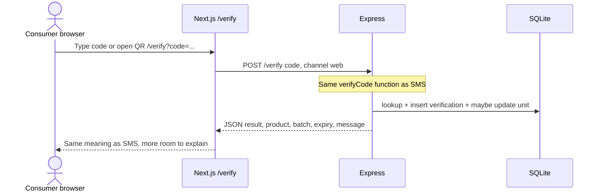

**Invariant:** SMS and web must call one shared function: `verifyCode(code, channel, actor)`. Different doors, one brain.

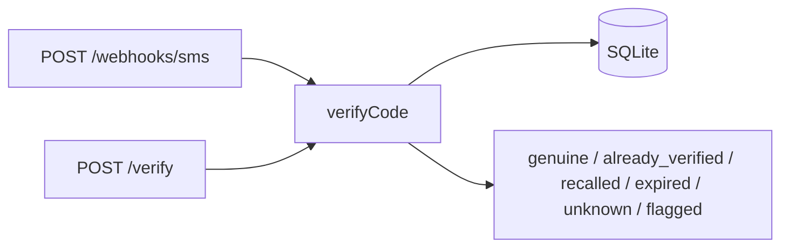

---

### Flow E — Duplicate / likely copy

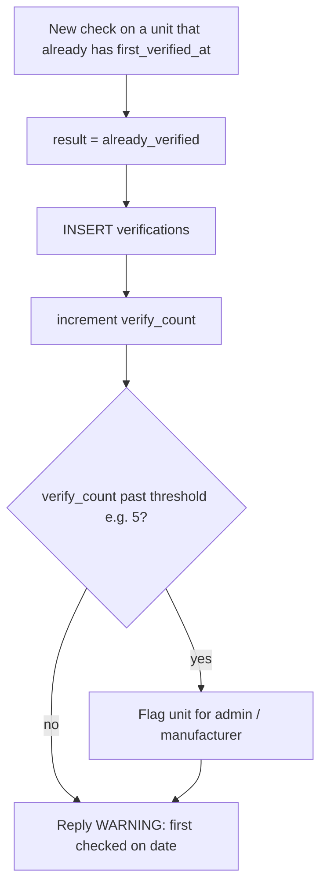

No extra product is created. The **history of checks** is what exposes the copy.

---

### Flow F — Recall

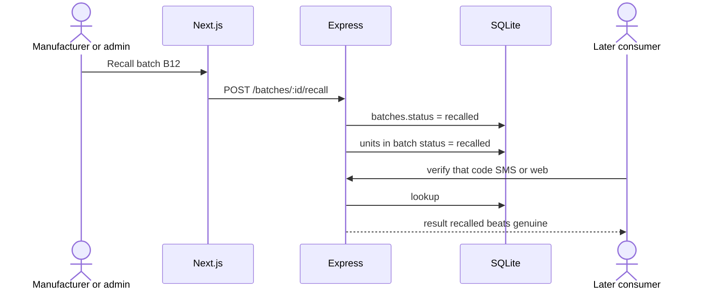

---

### Flow G — Unknown code (likely fake or mis-typed)

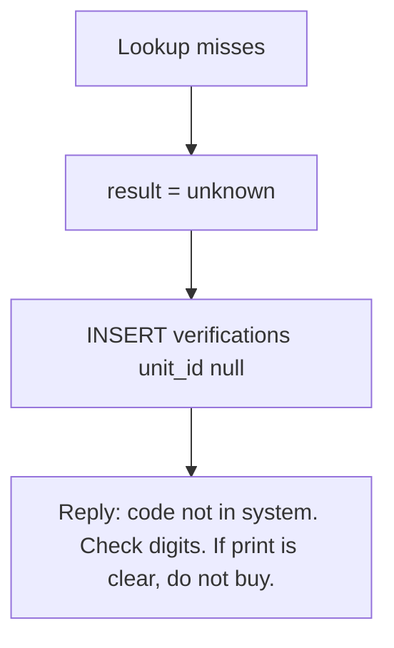

Unknown attempts are gold for admin: clusters of guesses or cloned “pretty” codes.

---

## 6. Request map (who calls what)

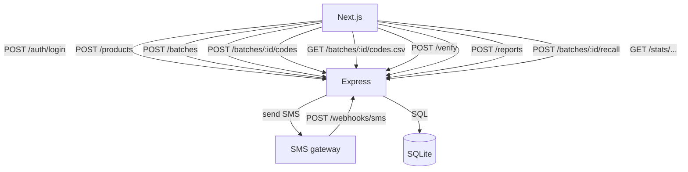

| From | To | When | Payload (idea) |
| --- | --- | --- | --- |
| Next.js | `POST /auth/login` | Staff login | email, password |
| Next.js | `POST /products` | New SKU | name, category, … |
| Next.js | `POST /batches` | New run | product_id, quantity, dates |
| Next.js | `POST /batches/:id/codes` | Generate units | count (or use batch quantity) |
| Next.js | `GET /batches/:id/codes.csv` | Print shop | auth required |
| Next.js | `POST /verify` | Public check | code, channel=web |
| Next.js | `POST /reports` | Consumer report | code, note |
| Next.js | `POST /batches/:id/recall` | Recall | reason |
| Next.js | `GET /stats/...` | Dashboard | auth, company scope |
| Gateway | `POST /webhooks/sms` | Inbound SMS | from, text, id, signature |
| Express | Gateway send API | Outbound SMS | to, message |
| Express | SQLite | Every command above | SQL |

Full route list lives in [BACKEND.md](./BACKEND.md). Screen list lives in [FRONTEND.md](./FRONTEND.md). Tables live in [DATABASE.md](./DATABASE.md).

---

## 7. Sequence: SMS verify (happy path)

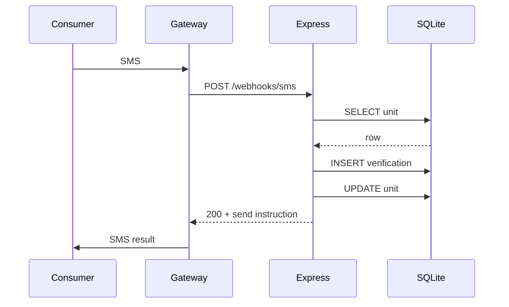

Express should respond to the webhook quickly. Sending the SMS can be in-process for v1 (pilot volume is low). If volume grows, a queue can sit between “decision” and “send”.

---

## 8. Data lifecycle of one unit

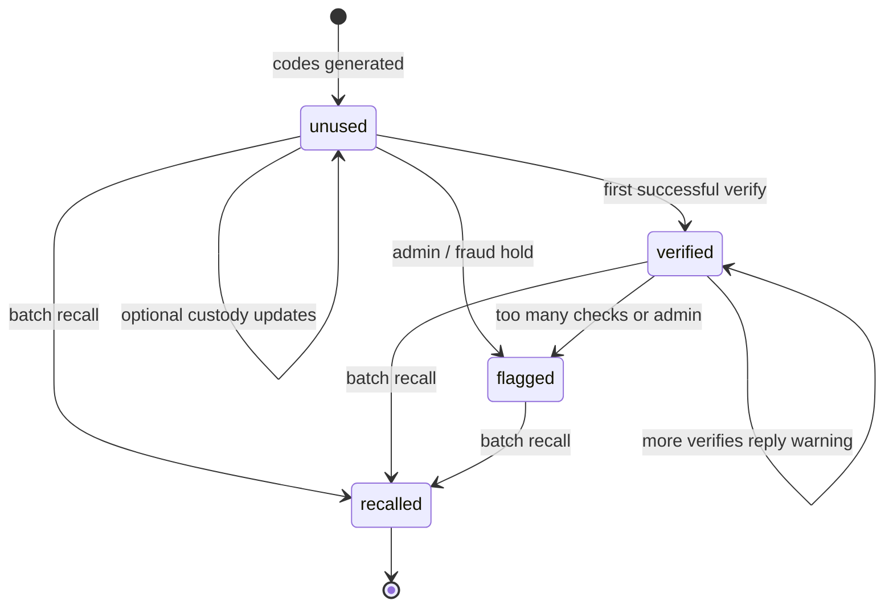

States are listed in [DATABASE.md](./DATABASE.md). Express owns transitions. Next.js only displays them.

---

## 9. What SQLite is good for — and the limit

**Good for now**

- One pilot country, one short code, thousands to low millions of units.
- Simple backup: copy the file.
- Matches “small manufacturers, small IT”.

**Not the long-term ceiling**

- Many concurrent SMS writes across regions will want **Postgres** (or similar).
- The **schema ideas** stay. The engine can change. Do not design tables that only SQLite can express.

---

## 10. Languages and message length

SMS replies must be **short**. Store templates in the backend (later: table). Default English for v1. Design every reply so a Swahili (or other) template can replace it without changing verify logic.

QR (optional): encodes a URL `https://kebs.example/verify?code=...` **and** the pack still shows the SMS instructions. QR without SMS text would exclude feature phones — that violates the product.

---

## 11. What we explicitly do not flow (v1)

- No payment data.
- No blockchain write.
- No consumer accounts for SMS users.
- No live GPS from feature phones (network location is optional and coarse if the gateway provides it).
- Next.js does not generate codes itself; Express does, so codes are never “invented” only in the browser.
