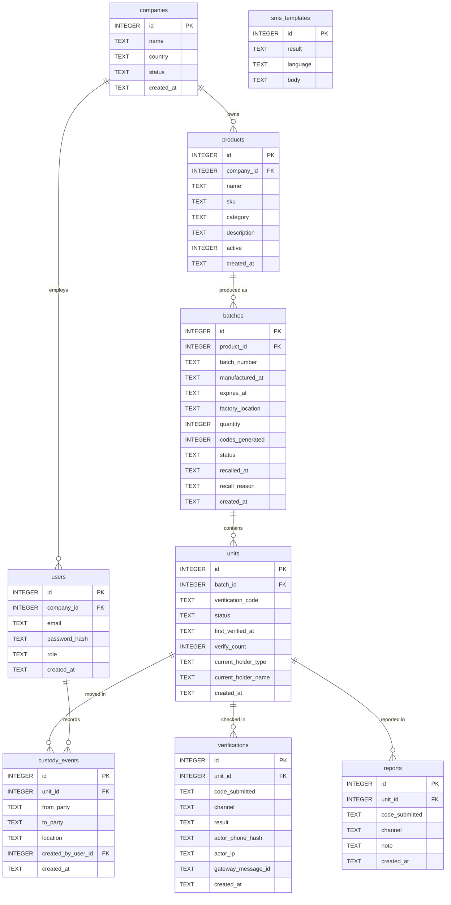
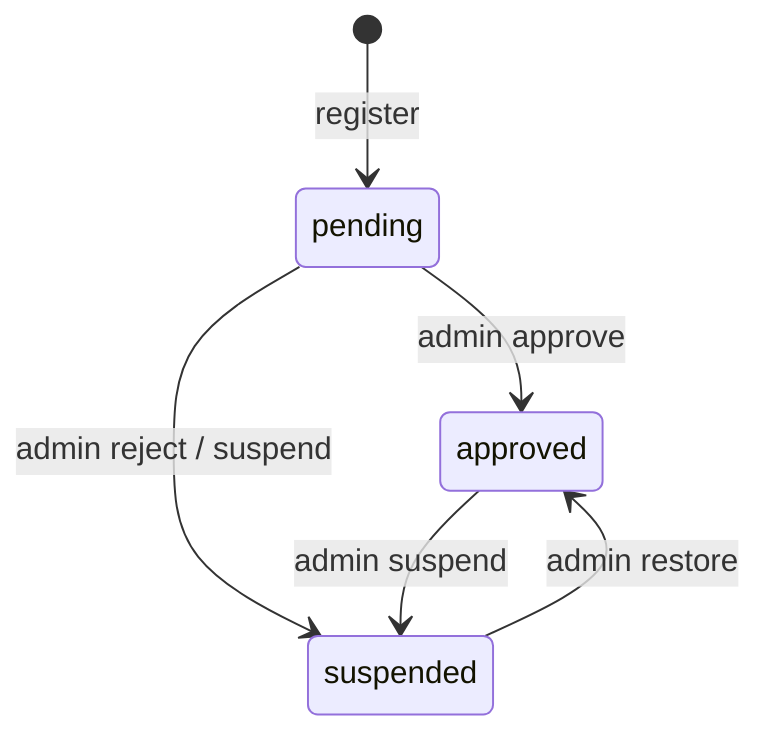
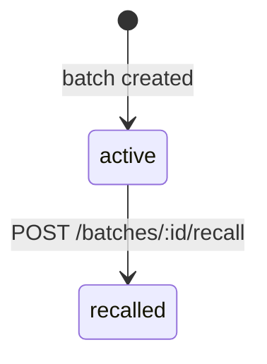
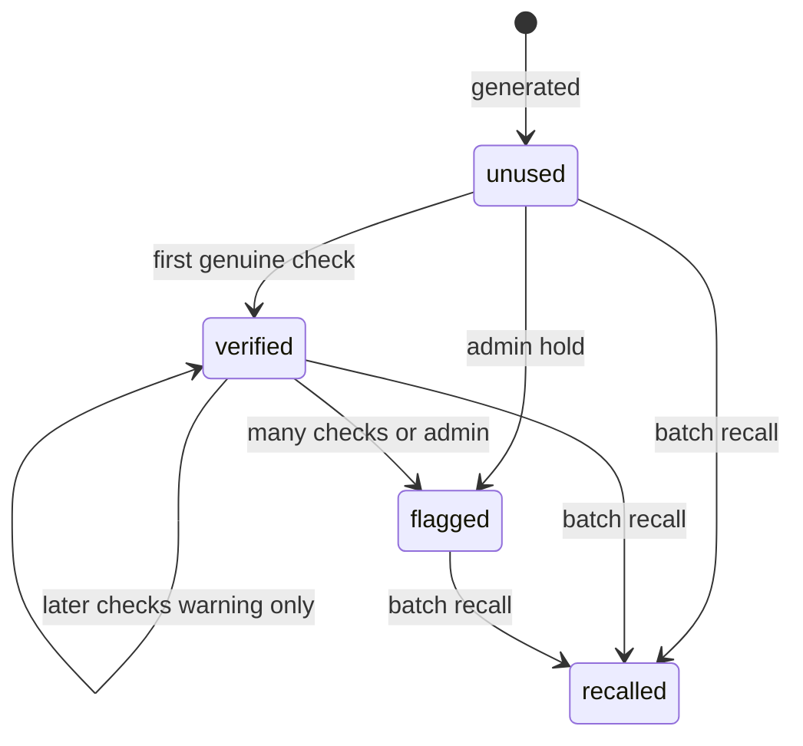
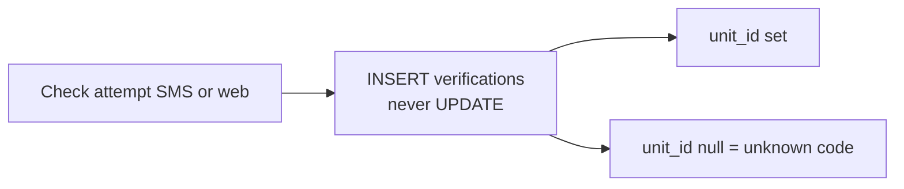
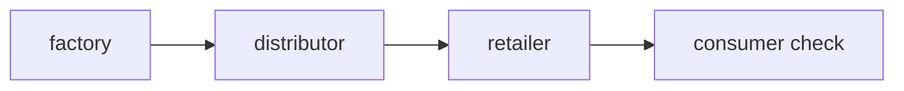
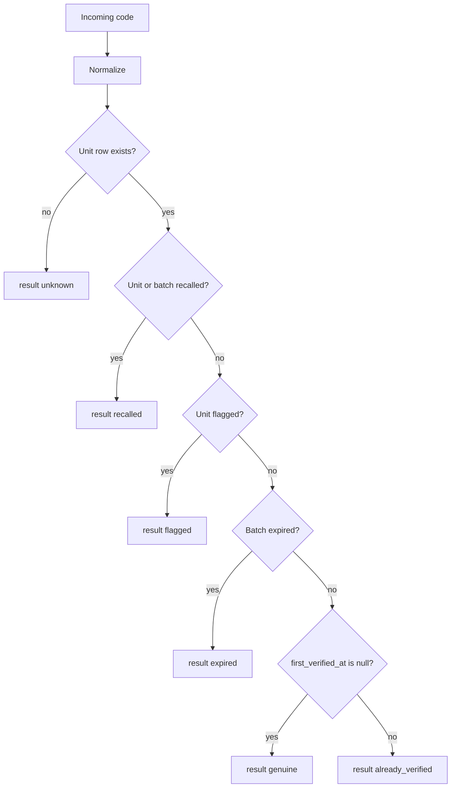
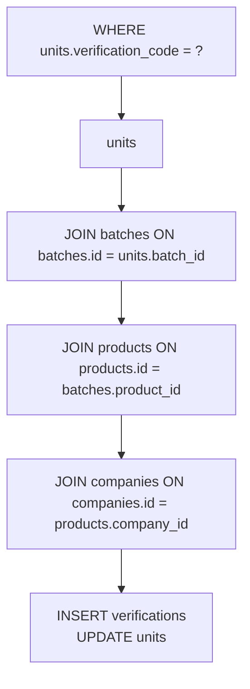

# Database (SQLite)

SQLite is the **source of truth** for companies, packs, and every check. Express is the only process that reads and writes it.

File idea: `data/kebs.db` (not committed). Journal mode when implemented: WAL.

---

## 1. Design rules

1. **One unit row = one physical pack = one verification code.**
2. **Verifications are append-only.** Never update a verification row to change history. Correct mistakes with a new note or admin flag on the unit.
3. **Manufacturer data is scoped by `company_id`.** Every product belongs to a company.
4. **Consumers are not users.** A phone number on a verification is not a login.
5. Names stay boring and stable so a later move to Postgres is copy-paste of ideas, not a redesign.

---

## 2. Entity relationship

Cardinality in words:

- One company has many users and many products.
- One product has many batches.
- One batch has many units (one code per pack).
- One unit has many verifications and optional custody events and reports.
- `verifications.unit_id` and `reports.unit_id` are null when the code is unknown.
- `users.company_id` is null only for `admin`.
- `sms_templates` is standalone (keyed by result + language).

---

## 3. Tables

### 3.1 `companies`

Who is allowed to issue codes.

| Column | Type | Meaning |
| --- | --- | --- |
| `id` | INTEGER PK | Internal id |
| `name` | TEXT | Legal / trading name |
| `country` | TEXT | ISO-ish country (e.g. KE) |
| `status` | TEXT | `pending` / `approved` / `suspended` |
| `created_at` | TEXT | ISO timestamp |

**Notes:** A company that is not `approved` must not generate units. Admin flips status.

---

### 3.2 `users`

Staff who log into Next.js.

| Column | Type | Meaning |
| --- | --- | --- |
| `id` | INTEGER PK | |
| `company_id` | INTEGER FK | Null only for `admin` |
| `email` | TEXT UNIQUE | Login |
| `password_hash` | TEXT | Never store plain passwords |
| `role` | TEXT | `manufacturer` / `retailer` / `admin` |
| `created_at` | TEXT | |

**Notes:** v1 one user per manufacturer is enough; the table still allows several users per company later.

---

### 3.3 `products`

The SKU on the pack.

| Column | Type | Meaning |
| --- | --- | --- |
| `id` | INTEGER PK | |
| `company_id` | INTEGER FK | Owner |
| `name` | TEXT | e.g. Paracetamol 500mg |
| `sku` | TEXT | Their internal SKU |
| `category` | TEXT | `medicine` / `food` / `cosmetic` / `alcohol` / `other` |
| `description` | TEXT | Short, may appear on web result |
| `active` | INTEGER | 0/1 |
| `created_at` | TEXT | |

**Unique:** (`company_id`, `sku`) when sku is present.

---

### 3.4 `batches`

One production run.

| Column | Type | Meaning |
| --- | --- | --- |
| `id` | INTEGER PK | |
| `product_id` | INTEGER FK | |
| `batch_number` | TEXT | Printed / factory batch id |
| `manufactured_at` | TEXT | Date |
| `expires_at` | TEXT | Date; used in verify rule |
| `factory_location` | TEXT | Optional free text |
| `quantity` | INTEGER | How many units to generate |
| `codes_generated` | INTEGER | 0 until generation runs |
| `status` | TEXT | `active` / `recalled` |
| `recalled_at` | TEXT | Null if not recalled |
| `recall_reason` | TEXT | Optional |
| `created_at` | TEXT | |

**Unique:** (`product_id`, `batch_number`).

---

### 3.5 `units`

The pack. The code people SMS.

| Column | Type | Meaning |
| --- | --- | --- |
| `id` | INTEGER PK | |
| `batch_id` | INTEGER FK | |
| `verification_code` | TEXT UNIQUE | 8-char public code |
| `status` | TEXT | `unused` / `verified` / `recalled` / `flagged` |
| `first_verified_at` | TEXT | Null until first genuine check |
| `verify_count` | INTEGER | Default 0 |
| `current_holder_type` | TEXT | Optional: `factory` / `distributor` / `retailer` |
| `current_holder_name` | TEXT | Optional |
| `created_at` | TEXT | |

**Indexes:** `verification_code` (unique — this is the SMS hot path). `batch_id` for recall and stats.

---

### 3.6 `verifications`

Every attempt, success or not.

| Column | Type | Meaning |
| --- | --- | --- |
| `id` | INTEGER PK | |
| `unit_id` | INTEGER FK | Null when result is `unknown` |
| `code_submitted` | TEXT | Normalized code they sent |
| `channel` | TEXT | `sms` / `web` |
| `result` | TEXT | `genuine` / `already_verified` / `recalled` / `expired` / `unknown` / `flagged` |
| `actor_phone_hash` | TEXT | SMS: hash of MSISDN; web: null |
| `actor_ip` | TEXT | Web: optional |
| `gateway_message_id` | TEXT | SMS idempotency; unique when present |
| `created_at` | TEXT | |

**Indexes:** `unit_id`, `created_at`, `gateway_message_id`.  
**Unknown codes:** still stored so admin can see fakes and typos. `unit_id` is null.

Do not update these rows. They are the court record.

---

### 3.7 `custody_events` (Should, not required for SMS pilot)

Handoffs along the chain.

| Column | Type | Meaning |
| --- | --- | --- |
| `id` | INTEGER PK | |
| `unit_id` | INTEGER FK | Or later a shipment of many units |
| `from_party` | TEXT | |
| `to_party` | TEXT | |
| `location` | TEXT | Optional |
| `created_at` | TEXT | |
| `created_by_user_id` | INTEGER FK | Who recorded it |

v1 can skip this table and still ship SMS verify. When added, Express updates `units.current_holder_*` in the same transaction.

---

### 3.8 `reports`

Consumer says “this feels fake”.

| Column | Type | Meaning |
| --- | --- | --- |
| `id` | INTEGER PK | |
| `unit_id` | INTEGER FK | Null if unknown code |
| `code_submitted` | TEXT | |
| `channel` | TEXT | |
| `note` | TEXT | Short free text |
| `created_at` | TEXT | |

---

### 3.9 `sms_templates` (Should)

| Column | Type | Meaning |
| --- | --- | --- |
| `id` | INTEGER PK | |
| `result` | TEXT UNIQUE | Matches verify result |
| `language` | TEXT | `en` v1 |
| `body` | TEXT | With placeholders `{product}` `{date}` `{batch}` |

If the table is empty, Express uses built-in English strings from [BACKEND.md](./BACKEND.md).

---

## 4. Status values (closed lists)

**`companies.status`**

| Value | Meaning |
| --- | --- |
| `pending` | Signed up; cannot generate codes |
| `approved` | Can generate and recall own batches |
| `suspended` | Login maybe; no new codes |

**`batches.status`**

| Value | Meaning |
| --- | --- |
| `active` | Normal |
| `recalled` | All checks should return recalled |

**`units.status`**

| Value | Meaning |
| --- | --- |
| `unused` | Never successfully verified |
| `verified` | At least one genuine first-check |
| `recalled` | Must not be used |
| `flagged` | Too many checks or admin hold |

**`verifications.result`**

| Value | Meaning |
| --- | --- |
| `genuine` | First valid check of an active, non-expired unit |
| `already_verified` | Valid code, not first check |
| `recalled` | Batch or unit recalled |
| `expired` | Past `batches.expires_at` |
| `unknown` | No unit row |
| `flagged` | Unit under review |

---

## 5. What a verify read looks like

To answer SMS, Express needs one round trip conceptually:

Keep this path **indexed and small**. This is the hot path for the whole product.

---

## 6. Privacy

| Data | Policy for v1 |
| --- | --- |
| Password | Hash only |
| SMS phone | Store **hash** on `verifications.actor_phone_hash` so we can see “same phone checked twice” without printing the number on dashboards |
| IP | Optional, for web rate limit and abuse |
| Verification codes | Secret-ish; dashboards may mask middle characters on shared screens |

Public `/verify` response must **not** include phone hashes, IPs, or other units in the same batch.

---

## 7. Volume (order of magnitude)

Pilot thinking, not a promise:

| Thing | Rough size |
| --- | --- |
| Companies | tens–hundreds |
| Products | hundreds |
| Units | thousands–low millions |
| Verifications | grows every day; largest table |

SQLite is acceptable at the low end of this. Plan a Postgres migration **when** concurrent SMS writes or file-size operations become painful — same tables.

---

## 8. Backup

Copy `kebs.db` (and `-wal`/`-shm` if WAL is on) to safe storage on a schedule. A lost file means **all codes unverifiable** and no history. Treat the file like production data from the first real pack.

---

## 9. Seed ideas (for later, not now)

- One admin user.
- One approved demo company, one medicine product, one batch, a handful of known codes for SMS tests.
- Never seed “real” medicine brands without permission.

---

## 10. Mapping to user stories

| Story | Tables touched |
| --- | --- |
| US-C1 SMS verify | `units`, `verifications`, `batches`, `products` |
| US-C3 web verify | same |
| US-C4 already checked | `units.first_verified_at`, `verifications` |
| US-M2 generate codes | `batches`, `units` |
| US-M5 recall | `batches`, `units` |
| US-A1 approve company | `companies` |
| US-R1 custody | `custody_events`, `units` |
