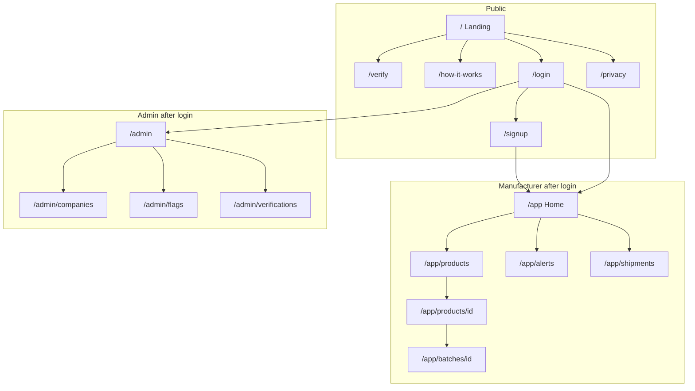

# Frontend

**Location of this doc:** repo root — [`FRONTEND.md`](./FRONTEND.md)  
**Code:** [`apps/web`](./apps/web)

The frontend is everything a person sees in a **browser**. It is not the SMS experience. SMS is phone + gateway + Express.

---

## Stack

| Now (sample) | Later (production target) |
| --- | --- |
| **Vite + React + TypeScript** in `apps/web` | **Next.js** (App Router) when dashboards + auth land |
| React Router (`/`, `/verify`) | Same public routes; add `/login`, `/app/*`, `/admin/*` |
| Hardcoded demo codes on `/verify` | `POST /verify` → Express → SQLite |
| Tailwind + shadcn-style UI primitives | Keep visual language; wire to real API |

**Rules that do not change**

- Frontend talks only to Express over HTTPS (JSON). Never opens SQLite.
- Does not mint codes, send SMS, or own “already verified” truth.
- Feature-phone SMS stays first-class; this UI is the extra door.

---

## Repo layout (frontend-related)

```
atf/
  README.md                 # product overview + how to run
  FRONTEND.md               # this file (root)
  docs/
    ARCHITECTURE_DATAFLOW.md
    BACKEND.md
    DATABASE.md
  apps/
    web/                    # sample landing (runnable now)
      index.html
      package.json
      vite.config.ts
      public/
      src/
        main.tsx
        App.tsx             # routes
        index.css           # design tokens
        pages/
          Index.tsx         # landing /
          Verify.tsx        # /verify (demo)
          NotFound.tsx
        components/
          Navigation.tsx
          Hero.tsx
          Tagline.tsx
          HowItWorks.tsx
          Features.tsx
          Footer.tsx
          ScrollToTop.tsx
          ui/               # button, input, label, toast, tooltip
        hooks/
          use-toast.ts
        lib/
          utils.ts
    api/                    # Express — not built yet
  data/                     # SQLite file later (gitignored)
```

---

## Run the sample

```bash
cd apps/web
npm install
npm run dev
```

Open [http://127.0.0.1:5173](http://127.0.0.1:5173).

| Path | Status | What you see |
| --- | --- | --- |
| `/` | **Built** | Hero, Vero hook, how it works, features, footer |
| `/verify` | **Built (demo)** | Code box; local fake lookup, no Express |
| `/login`, `/signup`, `/app/*`, `/admin/*` | **Built (demo)** | Local session; no Express yet |

**Demo codes on `/verify`:** `7K4P2M9Q`, `A3N8R2T6`, `H9C1L5W2` (genuine) · `FAKE0001` (unknown)

---

## Who uses the frontend

| Audience | Logged in? | Purpose |
| --- | --- | --- |
| Consumer | No | Type or scan a code, read the result, optionally report a fake. |
| Manufacturer | Yes (`manufacturer`) | Products, batches, codes, stats, recalls, shipments. |
| Admin | Yes (`admin`) | Approve companies, watch flags, system health. |
| Retailer | Yes (`retailer`) | Later: confirm receipt. Can use public verify without an account. |

Feature-phone users **never need this app**.

---

## Information architecture (pages)



| Path | Who | Job | Sample status |
| --- | --- | --- | --- |
| `/` | Public | What Vero is, how to SMS, verify CTA | Built |
| `/verify` | Public | Code box + result | Built (demo data) |
| `/how-it-works` | Public | Pack → SMS or web → reply | On landing as `#how-it-works` |
| `/login` | Staff | Manufacturer / admin / retailer | Built (demo) |
| `/signup` | Manufacturer | Register company (`pending`) | Built (demo) |
| `/app` | Manufacturer | Counts: codes, checks, alerts | Built (demo) |
| `/app/products` | Manufacturer | List + create SKU | Built (demo) |
| `/app/products/[id]` | Manufacturer | Product detail, batches | Built (demo) |
| `/app/batches/[id]` | Manufacturer | Generate/export codes, recall | Built (demo) |
| `/app/alerts` | Manufacturer | Hot / flagged codes | Built (demo) |
| `/app/shipments` | Manufacturer | Custody (phase 1.5) | Built (demo) |
| `/admin` | Admin | Overview | Built (demo) |
| `/admin/companies` | Admin | Approve / suspend | Built (demo) |
| `/admin/flags` | Admin | Unknown / high-repeat | Built (demo) |
| `/admin/verifications` | Admin | Searchable log | Built (demo) |
| `/privacy` | Public | What we store | Planned |

---

## Screen-by-screen

### Landing `/` (built)

**Job:** In 10 seconds, a shopper or factory owner knows what to do.

| Section | Component | Content |
| --- | --- | --- |
| Nav | `Navigation.tsx` | Vero mark, How it works, Verify, theme toggle |
| Hero | `Hero.tsx` | Full-bleed slides, “Know It's Real. Instantly.”, SMS hint, CTA → `/verify` |
| Hook | `Tagline.tsx` | Product hook (fake medicine / SMS on any phone) |
| Steps | `HowItWorks.tsx` | Register → Scan or SMS → Instant result |
| Features | `Features.tsx` | Registration, verify, SMS, traceability, analytics |
| Footer | `Footer.tsx` | Links + contact |

No API required yet.

---

### Verify `/verify` (built — demo)

**Job:** Same decision as SMS, readable on a larger screen.

**UI today**

- One input + “Check authenticity”.
- Demo chips for sample codes.
- Result: authentic vs unknown (simplified). When Express exists, map to full result set below.

**Target result states** (match SMS / [docs/BACKEND.md](./docs/BACKEND.md)):

| Result | Colour intent | User must see |
| --- | --- | --- |
| `genuine` | Calm | Product, manufacturer, batch, expiry; first check vs not |
| `already_verified` | Warning | When first checked; if that was not you, do not use |
| `recalled` | Danger | Do not use |
| `expired` | Danger | Past expiry; do not use |
| `unknown` | Neutral/danger | Not in system; check digits / treat as unsafe |
| `flagged` | Danger | Under review; do not use |

**API (when wired):** `POST /verify` `{ code, channel: "web" }`.  
**QR:** `/verify?code=...` pre-fill; pack still shows SMS text.

**Must not:** Claim “100% safe”. Describe **code** status only.

---

### Login `/login` and signup `/signup` (built — demo)

Email + password. Demo accounts (no Express yet):

- `manufacturer@vero.demo` / `demo1234` → `/app`
- `admin@vero.demo` / `demo1234` → `/admin`

Signup is manufacturer-only (`POST /auth/register` later). New companies start `pending`. Prefer httpOnly cookie when the API exists.

---

### Manufacturer `/app` (built — demo)

Interactive analytics: stacked 14-day checks, category chips (personal care, food/alcoholic & drinks, construction, automotive), share cards. Brown theme with light/dark toggle.  
Recent verifications **for this company only**.  
API: `GET /stats/overview`, `GET /verifications?limit=20`

---

### Products & batches (built — demo)

- `/app/products` — list + create (`GET/POST /products`)
- `/app/products/[id]` — batches (`GET /products/:id`, `POST /batches`)
- `/app/batches/[id]` — generate codes, CSV export, recall, stats  
  (`POST /batches/:id/codes`, `GET .../codes.csv`, `POST .../recall`)

Do not dump tens of thousands of codes in HTML — CSV for print.

---

### Alerts & admin (built — demo)

- `/app/alerts` — high `verify_count` / flagged units  
- `/admin/companies` — approve before code generation  
- `/admin/flags`, `/admin/verifications`, `/admin/reports`

---

## UI rules

1. **One primary action per screen.** Verify = one box.
2. **SMS visible on public pages.** `SMS KEBS <code> to <shortcode>`.
3. **Same words as SMS:** Genuine / Warning / Not found / Recalled.
4. **Company scope in UI; backend enforces.**
5. **Mobile-first** public pages; dashboards can be wider.
6. **No consumer account** for SMS or public verify.

---

## Client state

| State | Where | Notes |
| --- | --- | --- |
| Auth session | Cookie / token | `/app`, `/admin` only |
| Verify form | Component state | Do not keep codes in localStorage |
| Flash / toast | Toast | “Batch recalled”, “Codes generated” |

No global store required for v1.

---

## Errors the UI must handle

| API | User sees |
| --- | --- |
| Network down | “Cannot reach Vero. Try SMS if you have signal.” |
| 401 | Redirect `/login` |
| 403 | “You cannot do this.” |
| 404 | “Not found.” |
| 429 | “Too many checks. Wait a minute.” |
| 5xx | “Vero is having a problem. Try again or SMS.” |

---

## Accessibility

- High contrast result banners; words, not colour alone.
- English v1; room for longer Swahili later.
- Type size readable at a kiosk glance.

---

## What the frontend will not do

- Mint verification codes  
- Send SMS  
- Be source of truth for “already verified”  
- Require a consumer account  
- Replace printed SMS instructions with QR-only packaging  

---

## Related docs

| Doc | Role |
| --- | --- |
| [README.md](./README.md) | Product + run commands |
| [docs/ARCHITECTURE_DATAFLOW.md](./docs/ARCHITECTURE_DATAFLOW.md) | System map and flows |
| [docs/BACKEND.md](./docs/BACKEND.md) | Express routes and verify rules |
| [docs/DATABASE.md](./docs/DATABASE.md) | SQLite schema |
