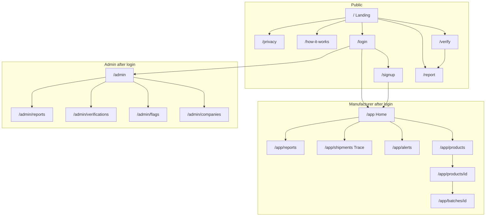

# Frontend

**Location of this doc:** repo root — [`FRONTEND.md`](./FRONTEND.md)  
**Code:** [`apps/web`](./apps/web)

The frontend is everything a person sees in a **browser**. It is not the SMS experience. SMS is phone + gateway + Express.

---

## Stack

| Layer | Choice |
| --- | --- |
| **Vite + React + TypeScript** in `apps/web` | Public verify, manufacturer, and admin |
| React Router | `/`, `/verify`, `/login`, `/signup`, `/app/*`, `/admin/*` |
| Live Express API | `VITE_API_BASE_URL` + `POST /api/verify` `{ "code" }` |
| Tailwind + shadcn-style UI primitives | Unchanged |

**Rules that do not change**

- Frontend talks only to Express over HTTPS (JSON). Never opens SQLite.
- Does not mint codes, send SMS, or own “already verified” truth.
- Feature-phone SMS stays first-class; this UI is the extra door.

---

## Repo layout (frontend-related)

```
atf/
  README.md                 # product overview + how to run
  FRONTEND.md               # this file (root)
  docs/
    ARCHITECTURE_DATAFLOW.md
    BACKEND.md
    DATABASE.md
  apps/
    web/                    # Vite SPA — live API client
      wrangler.jsonc        # Cloudflare Worker (SPA + /api proxy)
      worker.js             # /api proxy + /config.json (Mapbox secrets)

```

---

## Run

Copy [`apps/web/.env.example`](apps/web/.env.example) to `.env`. Set `VITE_API_BASE_URL` to the live Express origin (TryCloudflare hostnames rotate).

```bash
cd apps/web
npm install
npm run dev
```

Open [http://127.0.0.1:5173](http://127.0.0.1:5173). Dev proxies `/api` and `/health` to `VITE_API_BASE_URL`.

| Path | Status | What you see |
| --- | --- | --- |
| `/` | Live | Hero, Vero hook, how it works, features, footer |
| `/verify` | Live | `POST /api/verify` `{ "code": "SGSP792F" }` |
| `/login`, `/signup`, `/app/*`, `/admin/*` | Live | Bearer token against Express + SQLite |

**Example unit already in SQLite:** `SGSP792F`

### Cloudflare Workers

App root is `apps/web`. On a Git-connected Worker, use branch `frontend` and set **Root directory** to `apps/web`.

```bash
cd apps/web
npm run build
npx wrangler deploy
```

The Worker serves `dist` as an SPA. Mapbox is **not** baked in at build time: set Worker secrets so you can change the token in the dashboard without a rebuild.

```bash
printf '%s' "https://your-tunnel.trycloudflare.com" | npx wrangler secret put API_ORIGIN
printf '%s' "pk.your_mapbox_token" | npx wrangler secret put MAPBOX_ACCESS_TOKEN
printf '%s' "mapbox://styles/your-username/your-style" | npx wrangler secret put MAPBOX_STYLE
```

The browser calls same-origin `/api` (proxied to `API_ORIGIN`) and `/config.json` (Mapbox token + style).

**Africa's Talking:** API keys stay on Express. Callback should hit the live webhook (typically `POST /api/webhooks/sms`). The UI only shows `VITE_SMS_KEYWORD` + `VITE_SMS_SHORTCODE`.

---

## Who uses the frontend

| Audience | Logged in? | Purpose |
| --- | --- | --- |
| Consumer | No | Type or scan a code, read the result, optionally report a fake. |
| Manufacturer | Yes (`manufacturer`) | Products, batches, codes, stats, recalls, shipments. |
| Admin | Yes (`admin`) | Approve companies, watch flags, system health. |
| Retailer | Yes (`retailer`) | Later: confirm receipt. Can use public verify without an account. |

Feature-phone users **never need this app**.

---

## Information architecture (pages)



| Path | Who | Job | Sample status |
| --- | --- | --- | --- |
| `/` | Public | What Vero is, how to SMS, verify CTA | Built |
| `/verify` | Public | Code box + result | Live `POST /api/verify` |
| `/report` | Public | Report a suspected counterfeit | Live `POST /api/reports` |
| `/how-it-works` | Public | Pack → SMS or web → reply | On landing as `#how-it-works` |
| `/login` | Staff | Manufacturer / admin / retailer | Live `POST /api/auth/login` |
| `/signup` | Manufacturer | Register company (`pending`) | Live `POST /api/auth/register` |
| `/app` | Manufacturer | Counts: codes, checks, alerts | Live |
| `/app/products` | Manufacturer | List + create SKU | Live |
| `/app/products/[id]` | Manufacturer | Product detail, batches | Live |
| `/app/batches/[id]` | Manufacturer | Generate/export codes, recall | Live |
| `/app/alerts` | Manufacturer | Hot / flagged codes; Open on Trace | Live |
| `/app/shipments` | Manufacturer | Mapbox Trace from live checks | Live (geo if API sends lat/lng) |
| `/app/shipments/:id` | Manufacturer | One route + checks | Live if `/api/shipments` exists |
| `/app/reports` | Manufacturer | Consumer counterfeit reports | Live |
| `/admin` | Admin | Overview | Live |
| `/admin/companies` | Admin | Approve / suspend | Live |
| `/admin/flags` | Admin | Unknown / high-repeat | Live |
| `/admin/verifications` | Admin | Searchable log | Live |
| `/admin/reports` | Admin | All consumer reports | Live |
| `/privacy` | Public | What we store | Planned |

---

## Screen-by-screen

### Landing `/` (built)

**Job:** In 10 seconds, a shopper or factory owner knows what to do.

| Section | Component | Content |
| --- | --- | --- |
| Nav | `Navigation.tsx` | Vero mark, How it works, Verify, theme toggle |
| Hero | `Hero.tsx` | Full-bleed slides, “Know It's Real. Instantly.”, SMS hint, CTA → `/verify` |
| Hook | `Tagline.tsx` | Product hook (fake medicine / SMS on any phone) |
| Steps | `HowItWorks.tsx` | Register → Scan or SMS → Instant result |
| Features | `Features.tsx` | Registration, verify, SMS, traceability, analytics |
| Footer | `Footer.tsx` | Links + contact |

Landing copy does not mint codes. Verify uses the live API.

---

### Verify `/verify` (live)

**Job:** Same decision as SMS, readable on a larger screen.

**API:** `POST {VITE_API_BASE_URL}/api/verify` with `{ "code": "SGSP792F" }`.

Result states: `genuine`, `already_verified`, `recalled`, `expired`, `unknown`, `flagged`.

**QR:** `/verify?code=...` pre-fill; pack still shows SMS text.

**Must not:** Claim “100% safe”. Describe **code** status only.

---

### Login `/login` and signup `/signup`

Email + password against Express (`POST /api/auth/login`, `POST /api/auth/register`). Session is a Bearer token in localStorage (cross-origin SPA). New companies start `pending`.

---

### Manufacturer `/app`

Interactive analytics from `GET /api/stats/overview` and `GET /api/verifications?limit=20`.

### Products & batches

- `/app/products` — list + create (`GET/POST /api/products`)
- `/app/products/[id]` — batches (`GET /api/products/:id`, `POST /api/batches`)
- `/app/batches/[id]` — generate codes, CSV export, recall  
  (`POST /api/batches/:id/codes`, `GET .../codes.csv`, `POST .../recall`)

### Alerts & admin

- `/app/alerts` — `GET /api/alerts`
- `/app/shipments` — Trace from live verifications (coordinates if present)
- `/app/reports` — `GET /api/reports`
- `/admin/companies` — `GET /api/admin/companies`, approve / suspend
- `/admin/flags`, `/admin/verifications`, `/admin/reports`

---

## UI rules

1. **One primary action per screen.** Verify = one box.
2. **SMS visible on public pages.** `SMS KEBS <code> to <shortcode>`.
3. **Same words as SMS:** Genuine / Warning / Not found / Recalled.
4. **Company scope in UI; backend enforces.**
5. **Mobile-first** public pages; dashboards can be wider.
6. **No consumer account** for SMS or public verify.

---

## Client state

| State | Where | Notes |
| --- | --- | --- |
| Auth session | Bearer token in localStorage | `/app`, `/admin` only |
| Verify form | Component state | Do not keep codes in localStorage |
| Flash / toast | Toast | “Batch recalled”, “Codes generated” |

No global store required for v1.

---

## Errors the UI must handle

| API | User sees |
| --- | --- |
| Network down | “Cannot reach Vero. Try SMS if you have signal.” |
| 401 | Redirect `/login` |
| 403 | “You cannot do this.” |
| 404 | “Not found.” |
| 429 | “Too many checks. Wait a minute.” |
| 5xx | “Vero is having a problem. Try again or SMS.” |

---

## Accessibility

- High contrast result banners; words, not colour alone.
- English v1; room for longer Swahili later.
- Type size readable at a kiosk glance.

---

## What the frontend will not do

- Mint verification codes  
- Send SMS  
- Be source of truth for “already verified”  
- Require a consumer account  
- Replace printed SMS instructions with QR-only packaging  

---

## Related docs

| Doc | Role |
| --- | --- |
| [README.md](./README.md) | Product + run commands |
| [docs/ARCHITECTURE_DATAFLOW.md](./docs/ARCHITECTURE_DATAFLOW.md) | System map and flows |
| [docs/BACKEND.md](./docs/BACKEND.md) | Express routes and verify rules |
| [docs/DATABASE.md](./docs/DATABASE.md) | SQLite schema |
