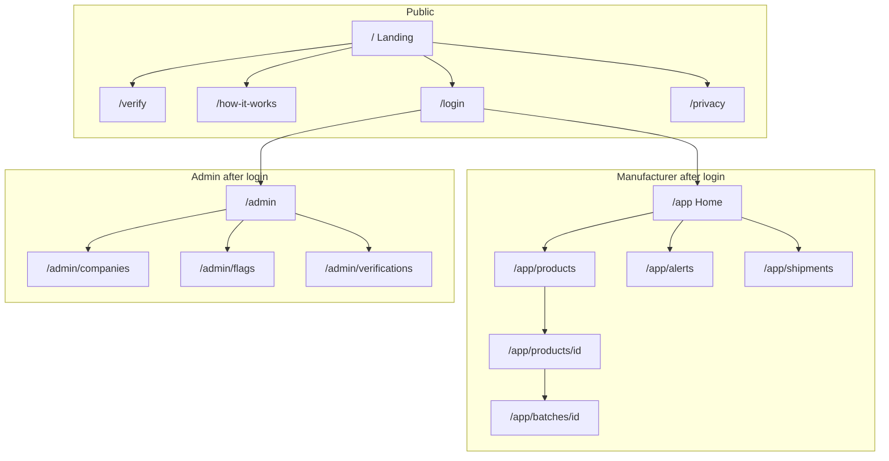

# Frontend (Next.js)

The frontend is everything a person sees in a **browser**. It is not the SMS experience. SMS is handled by the phone + gateway + Express.

**Stack:** Next.js (App Router). Talks to Express over HTTPS with JSON. No direct SQLite access.

---

## 1. Who uses the frontend

| Audience | Logged in? | Purpose |
| --- | --- | --- |
| Consumer | No | Type or scan a code, read the result, optionally report a fake. |
| Manufacturer | Yes (role `manufacturer`) | Products, batches, codes, stats, recalls, shipments. |
| Admin | Yes (role `admin`) | Approve companies, watch flags, system health. |
| Retailer | Yes (role `retailer`) | Later: confirm receipt. Can use public verify from day one without an account. |

Feature-phone users **never need this app**. If we bury verification only in the dashboard, we have failed.

---

## 2. Information architecture (pages)

| Path | Who | Job |
| --- | --- | --- |
| `/` | Public | What Kebs is, how to SMS, how to type a code |
| `/verify` | Public | Code box + result |
| `/how-it-works` | Public | Look at pack → SMS or web → read reply |
| `/login` | Staff | Manufacturer / admin / retailer |
| `/app` | Manufacturer | Counts: codes issued, checks today, alerts |
| `/app/products` | Manufacturer | List + create SKU |
| `/app/products/[id]` | Manufacturer | Product detail, batches |
| `/app/batches/[id]` | Manufacturer | Generate/export codes, recall |
| `/app/alerts` | Manufacturer | Codes with many checks / flagged |
| `/app/shipments` | Manufacturer | Optional custody (phase 1.5) |
| `/admin` | Admin | Overview |
| `/admin/companies` | Admin | Approve / suspend manufacturers |
| `/admin/flags` | Admin | Unknown codes, high-repeat units |
| `/admin/verifications` | Admin | Searchable log (no public PII) |
| `/privacy` | Public | What we store (including SMS numbers) |

---

## 3. Screen-by-screen (what it shows and what it calls)

### 3.1 Landing `/`

**Job:** In 10 seconds, a shopper or a factory owner knows what to do.

Content blocks (copy, not code):

- Hook: verify before it reaches your hands — SMS works on any phone.
- Example pack line: `SMS KEBS 7K4P2M9Q to 20880`
- Button: **Verify a code** → `/verify`
- Button: **I’m a manufacturer** → `/login`
- Short “why not only QR”: most buyers do not have a smartphone or data at the kiosk.

No API required except optional public stats (total checks) later.

---

### 3.2 Verify `/verify`

**Job:** Same decision as SMS, readable on a larger screen.

**UI**

- One input: verification code (accept spaces, lower case).
- Submit button: “Check authenticity”.
- Empty state: “Find the Kebs code on the pack. You can also SMS it.”
- Result panel — four visual states, matching backend results:

| Result | Colour intent | What the user must see |
| --- | --- | --- |
| `genuine` | Calm / positive | Product name, manufacturer, batch, expiry. “This is the first recorded check” or “You (or someone) checked this before on …” only when applicable — for first check, say first check clearly. |
| `already_verified` | Warning | Date/time of **first** check. Instruction: if that was not you, do not use. |
| `recalled` | Danger | Do not use. Contact seller / manufacturer. |
| `expired` | Danger | Past expiry date from batch. Do not use. |
| `unknown` | Neutral/danger | Not in database. Check typing. If print is clear, treat as unsafe. |
| `flagged` | Danger | Held for investigation. Do not use. |

Optional: “Report suspected fake” → `POST /reports`.

**API:** `POST /verify` with `{ code, channel: "web" }`.

**QR:** If URL is `/verify?code=...`, pre-fill and auto-submit once (still call the same API). The pack must still show SMS text; this page is an extra door.

**Must not:** Say “100% safe” or “cannot be fake”. Say what the **code** status is. A copied genuine code can still sit on a fake bottle until the second check.

---

### 3.3 Login `/login`

Email + password. `POST /auth/login`. Store session/token as the project will define in backend (httpOnly cookie preferred). Redirect by role: manufacturer → `/app`, admin → `/admin`.

---

### 3.4 Manufacturer home `/app`

**Cards**

- Products count
- Active batches
- Codes generated vs checked (this month)
- Open alerts (repeat verifies)

**Tables**

- Recent verifications on **this company’s** units only (product, result, channel, time). Never show another company’s data.

**API:** `GET /stats/overview`, `GET /verifications?limit=20`

---

### 3.5 Products `/app/products`

List: name, category (medicine / food / cosmetic / alcohol / other), SKU, active flag.

Create form: name, category, SKU, description (short).  
**API:** `GET /products`, `POST /products`

---

### 3.6 Product detail `/app/products/[id]`

Batches table: batch number, manufactured, expiry, quantity, codes generated, status (active / recalled).

Action: “New batch”.  
**API:** `GET /products/:id`, `GET /products/:id/batches`, `POST /batches`

---

### 3.7 Batch detail `/app/batches/[id]`

**Facts:** dates, expiry, quantity, status.

**Actions**

- Generate codes (if not yet generated, or remaining count — v1: generate once for `quantity`).
- Download CSV (code per row) for the printer.
- Recall batch (confirm typed batch number).

**Lists**

- Sample of units (do not dump 50,000 rows in the browser). Search one code.
- Verification counts for this batch: genuine first-checks vs warnings vs unknown (unknown won’t belong to this batch).

**API:** `GET /batches/:id`, `POST /batches/:id/codes`, `GET /batches/:id/codes.csv`, `POST /batches/:id/recall`, `GET /batches/:id/stats`

---

### 3.8 Alerts `/app/alerts`

Rows: unit code (masked except last 4 if we want caution on shared screens), verify_count, last check time, result trend.

Click → unit timeline (all `verifications` for that unit).

**API:** `GET /alerts`, `GET /units/:id`

---

### 3.9 Admin companies `/admin/companies`

Pending manufacturers: company name, country, contact. Approve / reject.  
**API:** `GET /admin/companies`, `POST /admin/companies/:id/approve`

Until approved, that user cannot generate codes.

---

### 3.10 Admin flags `/admin/flags`

Unknown-code bursts, high `verify_count` units, consumer reports.  
**API:** `GET /admin/flags`, `GET /admin/reports`

---

## 4. UI rules (keep it simple)

1. **One primary action per screen.** Verify page = one box. Batch page = generate or recall, not both screaming.
2. **SMS is visible everywhere public.** Footer: `SMS KEBS <code> to <shortcode>`.
3. **Results use the same words as SMS** (`Genuine`, `Warning`, `Not found`, `Recalled`) so a shop assistant can read the phone and the website aloud the same way.
4. **Manufacturer can only see their company.** Admin sees all. Frontend hides links; **backend enforces**.
5. **Do not render tens of thousands of codes in HTML.** Download CSV for print. On-screen search is for support.
6. **Mobile-first public pages.** The verify page must work on a small Android browser; dashboards can be wider.

---

## 5. Client state (what Next.js remembers)

| State | Where | Notes |
| --- | --- | --- |
| Auth session | Cookie / token | Required for `/app` and `/admin`. |
| Verify form | Component state | Throw away after result; do not keep codes in localStorage. |
| Flash messages | Query or toast | “Batch recalled”, “Codes generated”. |

No global store required for v1. Server data is fetched per page from Express.

---

## 6. Errors the UI must handle

| API situation | User sees |
| --- | --- |
| Network down | “Cannot reach Kebs. Try SMS if you have signal.” |
| 401 | Redirect to `/login` |
| 403 | “You cannot do this.” |
| 404 product | “Not found.” |
| 429 verify | “Too many checks. Wait a minute.” (bots / guessing) |
| 5xx | “Kebs is having a problem. Try again or SMS.” |

---

## 7. Accessibility and inclusion

- High contrast result banners (genuine vs warning).
- Do not rely on colour alone: include the word Genuine / Warning.
- Language: English v1; layout should allow longer Swahili strings later.
- Public type size large enough for a kiosk glance.

---

## 8. What the frontend will not do

- Will not mint verification codes.
- Will not send SMS.
- Will not be the source of truth for “already verified”.
- Will not require a consumer account.
- Will not replace the printed SMS instruction with QR-only packaging.
