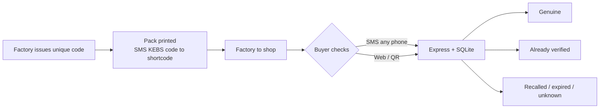
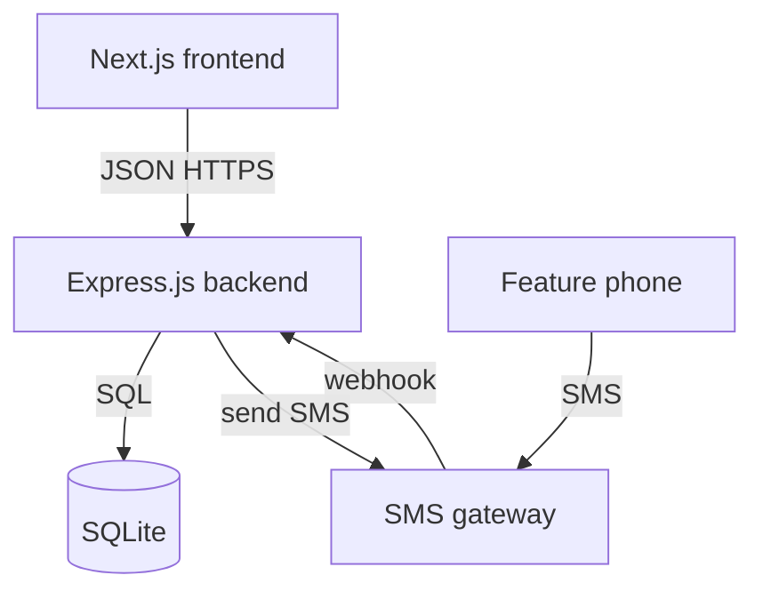

# Kebs

**Anyone, even with a basic phone, can verify a product before they buy it.**

Kebs is a product-authenticity and traceability system for African markets. A consumer sends a short SMS with a code printed on the pack. They get a reply in seconds: genuine, already used, recalled, or unknown. Manufacturers get a cheap way to protect brands. Retailers get a trusted shelf. Public health gets fewer fake medicines, adulterated foods, and dangerous cosmetics in people’s hands.

This repository holds design documents and a **sample landing page** you can open in the browser.

To view the landing page:

```bash
cd apps/web
npm install
npm run dev
```

Then open [http://127.0.0.1:5173](http://127.0.0.1:5173). Public pages: `/` (landing) and `/verify` (demo codes, no backend yet).

---

## The problem

Across Africa, counterfeit goods are common: fake alcohol, adulterated food, falsified medicines, unsafe cosmetics. Manufacturers lose revenue and reputation. Consumers cannot tell a real pack from a fake one at the kiosk.

Existing tools fail in three ways:

1. **Too expensive or complex** for small and mid-sized manufacturers.
2. **Smartphone-only** (QR apps, internet). Most people still use feature phones, or have no data at the moment of purchase.
3. **No live trail** from factory to shop, so a code can be copied, a batch recalled too late, or a leak in the supply chain stay invisible.

---

## The solution (one sentence)

Each **physical unit** gets a **unique code**. The consumer checks that code by **SMS** (or web). Kebs answers from a live database and records the check so a copied code cannot look “fresh” forever.

---

## Who it is for

| Role | They use Kebs to… |
| --- | --- |
| **Consumer** | Confirm a pack is real before paying or consuming it. Feature phone via SMS. Smartphone via SMS or web. |
| **Manufacturer** | Register products, print unique codes, see where goods are checked, recall a bad batch. |
| **Distributor / retailer** | Confirm stock received, keep custody of goods from factory to shelf. |
| **Admin (Kebs operator)** | Approve companies, watch fraud alerts, manage the system. |
| **Regulator (later)** | See recalls, fake-medicine alerts, and verification volume by region. |

---

## How a pack is verified (plain language)

1. Factory produces a batch and Kebs issues **one unique code per bottle / blister / jar**.
2. Code is printed on the pack as: **SMS instruction + short code**, and optionally a QR for phones with cameras.
3. Goods move: factory → distributor → retailer. Each handoff can be recorded.
4. At the shop, the buyer sends e.g. `KEBS 7K4P2M9Q` to a short number.
5. Kebs looks up the code and replies:
   - **Genuine** (first check, or same phone checking again).
   - **Already verified** (checked before — treat as warning if you did not check it).
   - **Recalled / expired**.
   - **Unknown** (not in the system — likely fake or damaged print).
6. Manufacturer sees the check on a dashboard (time, channel, rough location if the network provides it).



---

## User stories

Stories below are the product contract. They are grouped by role. Priority: **Must** = first build; **Should** = soon after; **Could** = later.

### Consumer

| ID | Story | Priority |
| --- | --- | --- |
| US-C1 | As a consumer with a feature phone, I send the pack code by SMS and get a clear yes/no-style reply, so I can decide before I buy or swallow the product. | Must |
| US-C2 | As a consumer, I understand the reply in simple language (Genuine / Warning / Not found / Recalled), so I do not need an app or training. | Must |
| US-C3 | As a consumer on a smartphone, I can type the same code on a website (or scan QR) and see the same result, so I am not locked to SMS. | Must |
| US-C4 | As a consumer, if a code was already checked, I am told **when** it was first checked, so I can judge whether this pack might be a copy. | Must |
| US-C5 | As a consumer, I can report “I think this is fake” after a check, so Kebs and the brand can investigate. | Should |
| US-C6 | As a consumer, I do not need airtime beyond a normal SMS, and I do not need internet, so verification works in rural shops and at night. | Must |

### Manufacturer

| ID | Story | Priority |
| --- | --- | --- |
| US-M1 | As a manufacturer, I register my company and products, so my goods can be verified. | Must |
| US-M2 | As a manufacturer, I create a **batch** (quantity, manufacture date, expiry, factory) and generate **one code per unit**, so each pack is unique. | Must |
| US-M3 | As a manufacturer, I export codes for printing (CSV / PDF sheet), so my existing pack line can apply them. | Must |
| US-M4 | As a manufacturer, I see how many times each batch/code was checked, by day and channel (SMS vs web), so I spot leaks and demand. | Must |
| US-M5 | As a manufacturer, I recall a batch in one action, so every future check of those codes says Recalled. | Must |
| US-M6 | As a small manufacturer, I can do this without custom hardware or a large IT team, so Kebs is cheaper than current anti-counterfeit vendors. | Must |
| US-M7 | As a manufacturer, I record who I shipped a set of codes to (distributor/retailer), so I have a trail from factory toward the shelf. | Should |
| US-M8 | As a manufacturer, I get an alert when a code is checked many times or in an unexpected place, so I can act on likely fakes. | Should |

### Retailer / distributor

| ID | Story | Priority |
| --- | --- | --- |
| US-R1 | As a distributor, I confirm I received a list of unit codes, so custody is recorded. | Should |
| US-R2 | As a retailer, I can check a pack the same way a consumer does, so I refuse fake stock before it hits the shelf. | Must |
| US-R3 | As a retailer, I mark codes as “on my shelf” when I receive them, so the last known location is the shop, not the factory. | Could |

### Admin

| ID | Story | Priority |
| --- | --- | --- |
| US-A1 | As an admin, I approve or reject manufacturer accounts, so only real companies issue codes. | Must |
| US-A2 | As an admin, I see flagged codes and unknown-code attempts, so I can support investigations. | Must |
| US-A3 | As an admin, I configure the SMS short code and reply templates, so messages stay short and local-language ready. | Should |

### Regulator (phase 2)

| ID | Story | Priority |
| --- | --- | --- |
| US-G1 | As a regulator, I see verification volume and recall events by product category (especially medicines), so I can target enforcement. | Could |

---

## Tech stack (locked for this version)



| Layer | Choice | Why |
| --- | --- | --- |
| **Frontend** | **Next.js** | Manufacturer/admin dashboards and a public verify page. Server-rendered where useful; talks only to the Express API. |
| **Backend** | **Express.js** (Node.js) | One API for web and for the SMS gateway webhook. Simple to host and reason about. |
| **Database** | **SQLite** | One file, zero extra server for the first version. Enough for a prototype and early pilots. Can move to Postgres later without changing the table *ideas*. |
| **SMS** | Gateway (e.g. Africa's Talking) | Feature phones have no app. SMS is the inclusion channel. Express receives a webhook, replies through the gateway. |
| **Auth** | Session or JWT on Express | Manufacturers and admins log into Next.js; API checks the token. Consumers verifying by SMS are **not** accounts. |

**Out of scope for v1:** native mobile apps, blockchain, custom scanners, payments, multi-country numbering complexity beyond one short code.

---

## Document map

| File | What it answers |
| --- | --- |
| [README.md](./README.md) | Problem, users, stories, stack (this file). |
| [FRONTEND.md](./FRONTEND.md) | Frontend layout, sample app, screens (root). |
| [docs/ARCHITECTURE_DATAFLOW.md](./docs/ARCHITECTURE_DATAFLOW.md) | How pieces connect and how data moves. |
| [docs/BACKEND.md](./docs/BACKEND.md) | Express routes, SMS webhook, services, rules. |
| [docs/DATABASE.md](./docs/DATABASE.md) | SQLite tables, fields, relationships. |

---

## Folder structure

```
atf/
  README.md
  FRONTEND.md              # frontend guide (stays at root)
  docs/
    ARCHITECTURE_DATAFLOW.md
    BACKEND.md
    DATABASE.md
  apps/
    web/                   # Sample landing (Vite + React) — run this now
    api/                   # Express.js (not built yet)
  data/
    kebs.db                # SQLite (gitignored, not created yet)
```

Details for `apps/web` live in [FRONTEND.md](./FRONTEND.md).
---

## Success for a first pilot

- A real pack with a printed code can be checked by **SMS** and by **web**, same answer.
- A **second check** of the same code is clearly a warning, not a silent “genuine”.
- A manufacturer can generate codes and **recall** a batch.
- Feature-phone users are first-class. Smartphones are extra, not required.
