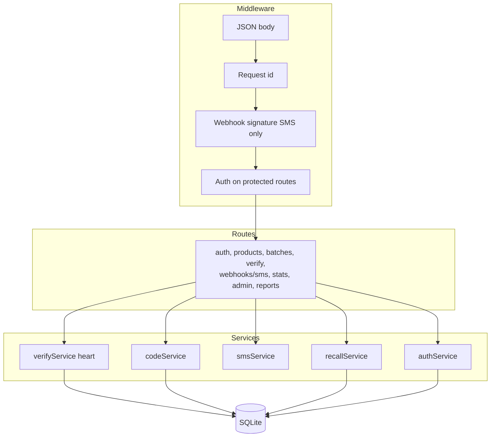
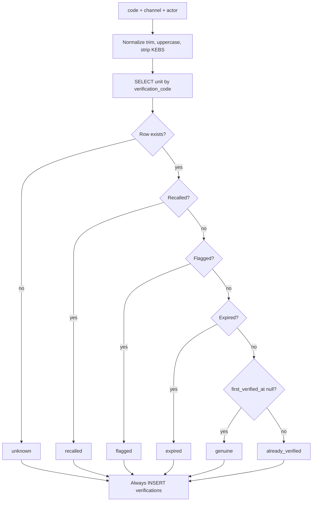

# Backend (Express.js)

The backend is the only place that **decides** if a code is genuine, already used, recalled, or unknown. Next.js and the SMS gateway are two doors into the same rules.

**Stack:** Node.js + Express.js. Persistence: SQLite (see [DATABASE.md](./DATABASE.md)). SMS: HTTP webhook in, HTTP send out.

Screens and sample app: [../FRONTEND.md](../FRONTEND.md).

---

## 1. Responsibilities

| Does | Does not |
| --- | --- |
| Authenticate manufacturer/admin/retailer | Authenticate SMS consumers |
| Create products, batches, unit codes | Print labels (CSV is enough) |
| Verify codes (shared function) | Talk to Next.js internals |
| Log every attempt | Trust the browser for occupancy of a code |
| Recall batches | Host the SQLite file as a public download |
| Call SMS gateway to reply | Implement the mobile network |

---

## 2. Process shape

**verifyService** is the heart. Both `POST /verify` and `POST /webhooks/sms` call it.

---

## 3. Verification rules (precise)

Input: `code` (string), `channel` (`sms` | `web`), `actor` (phone hash or `web` + optional IP).

Normalize code:

- Trim, uppercase, strip the keyword `KEBS` if present.
- Remove spaces and dashes.
- Reject if empty or length outside the allowed range (v1: 8 chars, alphabet below).

Lookup: `units.verification_code = normalized`.

Then **first matching outcome wins**:

| Order | Condition | Result code | Unit update |
| --- | --- | --- | --- |
| 1 | No row | `unknown` | none |
| 2 | Unit or batch `recalled` | `recalled` | increment `verify_count` only |
| 3 | Unit `flagged` | `flagged` | increment `verify_count` |
| 4 | Batch `expires_at` < today | `expired` | increment `verify_count` |
| 5 | Unit never verified (`first_verified_at` is null) | `genuine` | set `first_verified_at`, `status=verified`, `verify_count=1` |
| 6 | Else | `already_verified` | increment `verify_count` |

Always `INSERT` into `verifications` with the result, channel, timestamp, and actor reference.

**Threshold:** if `verify_count` reaches e.g. 5, set `units.status = flagged` (or keep verified and add an `alerts` row). Same idea: many checks ⇒ humans should look.

**Guessing protection:** rate limit `POST /verify` by IP. Rate limit SMS webhook by `from` number. Do not rate-limit so hard that a shop queue cannot check 20 packs.

---

## 4. Code format (generation)

- Length: **8** characters.
- Alphabet: `23456789ABCDEFGHJKLMNPQRSTUVWXYZ` (no `0/O`, `1/I` — people read SMS and packs in bad light).
- Cryptographically random, unique index in SQLite.
- Collision: retry insert a few times; abort batch if the world is on fire.
- Not derived from SKU or expiry (so nobody can invent a valid code from the label’s other text).

Printed instruction (manufacturer’s job, we put it on the CSV header):

`SMS KEBS <CODE> to <SHORTCODE>`

---

## 5. SMS webhook

**Route:** `POST /webhooks/sms`

**Before business logic:** verify the gateway signature / shared secret. If invalid → 401, no DB write.

**Parse** gateway JSON (fields differ by vendor; conceptually):

- `from` — consumer MSISDN
- `text` — body
- `to` — short code
- `id` — gateway message id (store for support)

**Then:** `verifyService.verify(...)`.

**Reply construction** (keep under 160 characters when possible):

| Result | Example English |
| --- | --- |
| genuine | `KEBS: Genuine. {product}. Exp {date}. Batch {n}. First check. If pack looks tampered, do not use.` |
| already_verified | `KEBS: WARNING. Code first checked {date}. If that was not you, do not use this product.` |
| recalled | `KEBS: RECALLED. Do not use. Return to seller. Batch {n}.` |
| expired | `KEBS: EXPIRED {date}. Do not use.` |
| unknown | `KEBS: Code not found. Check digits. If print is clear, do not buy.` |
| flagged | `KEBS: Do not use. This code is under review.` |

Then call gateway **send SMS** to `from`.

**HTTP response to gateway:** 200 quickly so the vendor does not retry into duplicate logic. Idempotency: store `gateway_message_id` unique; duplicate webhook → do not verify twice.

---

## 6. REST API (v1)

Base URL idea: `https://api.kebs.example` (or same host `/api` if reverse-proxied).

Auth: `Authorization: Bearer` or session cookie. Routes marked **Public** have no user.

### Auth

| Method | Path | Auth | Purpose |
| --- | --- | --- | --- |
| POST | `/auth/register` | Public | Create manufacturer account (status `pending`) |
| POST | `/auth/login` | Public | Issue session |
| POST | `/auth/logout` | User | End session |

### Products & batches

| Method | Path | Auth | Purpose |
| --- | --- | --- | --- |
| GET | `/products` | Manufacturer | List own products |
| POST | `/products` | Manufacturer (approved) | Create SKU |
| GET | `/products/:id` | Manufacturer | Detail |
| POST | `/batches` | Manufacturer | Create batch |
| GET | `/batches/:id` | Manufacturer | Detail |
| POST | `/batches/:id/codes` | Manufacturer | Generate unit rows |
| GET | `/batches/:id/codes.csv` | Manufacturer | Export for print |
| POST | `/batches/:id/recall` | Manufacturer or Admin | Recall |
| GET | `/batches/:id/stats` | Manufacturer | Check counts |

### Verify & reports

| Method | Path | Auth | Purpose |
| --- | --- | --- | --- |
| POST | `/verify` | Public | Web verify |
| POST | `/reports` | Public | “I think this is fake” |
| POST | `/webhooks/sms` | Gateway secret | Inbound SMS |

### Stats & units

| Method | Path | Auth | Purpose |
| --- | --- | --- | --- |
| GET | `/stats/overview` | Manufacturer | Dashboard cards |
| GET | `/verifications` | Manufacturer | Recent, scoped |
| GET | `/alerts` | Manufacturer | Hot codes |
| GET | `/units/:id` | Manufacturer | Timeline |

### Admin

| Method | Path | Auth | Purpose |
| --- | --- | --- | --- |
| GET | `/admin/companies` | Admin | Pending / all |
| POST | `/admin/companies/:id/approve` | Admin | Allow code generation |
| POST | `/admin/companies/:id/suspend` | Admin | Stop generation |
| GET | `/admin/flags` | Admin | System-wide |
| GET | `/admin/reports` | Admin | Consumer reports |
| GET | `/admin/verifications` | Admin | Search log |

### Custody (Should)

| Method | Path | Auth | Purpose |
| --- | --- | --- | --- |
| POST | `/custody` | Manufacturer / retailer | Record handoff |
| GET | `/units/:id/custody` | Manufacturer | Trail |

---

## 7. Authorization matrix

| Action | pending manufacturer | approved manufacturer | retailer | admin |
| --- | --- | --- | --- | --- |
| Login | yes | yes | yes | yes |
| Create product | no | yes (own) | no | no* |
| Generate codes | no | yes (own) | no | no |
| Recall own batch | no | yes | no | yes (any) |
| Verify (web) | yes as public | yes as public | yes as public | yes as public |
| See all companies | no | no | no | yes |

\*Admin may impersonate support later; not required in v1.

Every manufacturer query includes `company_id = me`. No “list all units in the country” for a brand user.

---

## 8. Service notes

**codeService.generate(batchId)**  
Read `batches.quantity`. Insert that many `units`. Set `batches.codes_generated`. Refuse if already generated (v1 simple: one shot).

**recallService.recall(batchId)**  
Set batch status. Update all units in batch to `recalled` unless you want to keep `flagged` as flagged (document the choice: v1 overwrite to recalled).

**smsService**  
Thin wrapper: parse inbound, send outbound, map vendor errors to logs.

**authService**  
Password hashed (e.g. bcrypt/argon2). Default role `manufacturer`, `company.status = pending`.

---

## 9. Config (environment ideas, not files)

| Name | Meaning |
| --- | --- |
| `DATABASE_PATH` | SQLite file location |
| `SMS_WEBHOOK_SECRET` | Validate inbound |
| `SMS_API_KEY` | Send replies |
| `SMS_SHORTCODE` | Printed on packs and in replies |
| `PUBLIC_VERIFY_URL` | For QR: `https://…/verify` |
| `JWT_SECRET` or session secret | Auth |

Never put these in Next.js public env.

---

## 10. Failures

| Failure | Behaviour |
| --- | --- |
| SQLite busy | Retry write; do not tell the consumer “genuine” without a commit |
| Gateway send fails | Log; verification row already stored; support can resend |
| Duplicate webhook | Ignore second apply of the same `gateway_message_id` |
| Manufacturer not approved | 403 on generate |

---

## 11. Observability (simple)

Log: request id, route, result of verify (`genuine` / `unknown` / …), duration. Do not log raw SMS bodies in production if they contain extra personal text; log normalized code and result.

Metrics to show later: SMS vs web volume, unknown rate, recall checks.

---

## 12. Testing the brain (when code exists)

Without hitting a real telco:

1. Insert a unit in SQLite.
2. `POST /verify` → `genuine`.
3. `POST /verify` again → `already_verified`.
4. Recall batch → `recalled`.
5. Random code → `unknown`.
6. Webhook payload with valid secret → same results + send function called.

That list is the acceptance bar for the backend.
